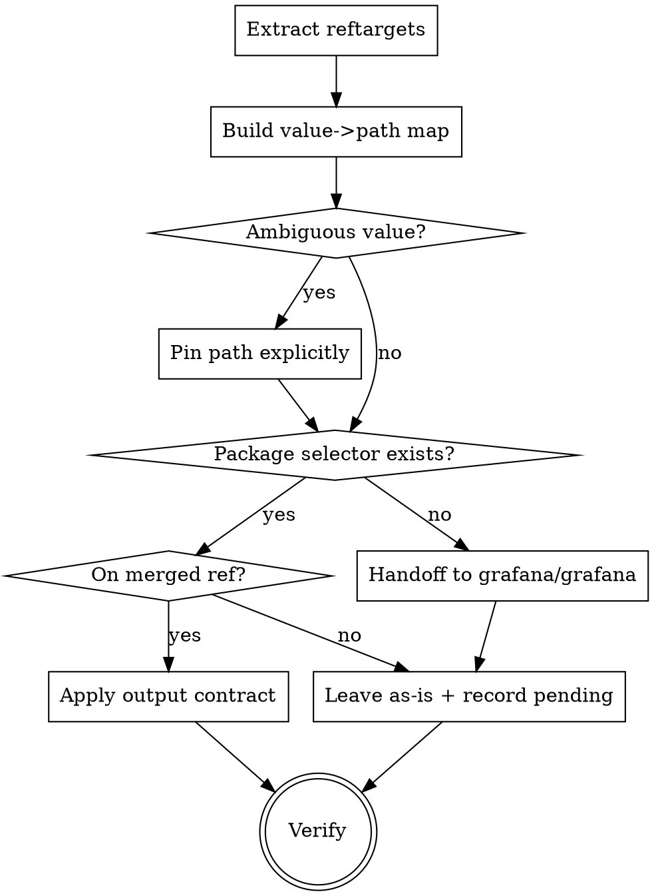

# Convert Guide Selectors

Move a guide's `reftarget` values onto `@grafana/e2e-selectors` using Pathfinder's **symbolic**
selector syntax, and hand off to grafana/grafana when a selector doesn't exist yet.

**Core principle:** a resolved `data-testid` string is a *snapshot of one Grafana version*. The
symbolic form is a *reference*. Always ship the reference.

**REQUIRED BACKGROUND:** Read [symbolic-selector-syntax.md](symbolic-selector-syntax.md) before
converting anything. It defines the three forms, the version-resolution behaviour, and five traps
that silently break guides.

Upstream reference (the authority, per [CLAUDE.md](../../../CLAUDE.md#pathfinder-source)):
`grafana-pathfinder-app/docs/developer/interactive-examples/selectors-reference.md` for the syntax,
`src/lib/dom/grafana-selector-core.ts` for the resolver.

## Prerequisites

| Need | Why |
| --- | --- |
| `GRAFANA_REPO=<path>` | a grafana/grafana checkout; the `.ts` scripts import the selectors package from it |
| `npx tsx` | runs the `.ts` scripts. This repo has no `package.json`, so `tsx` is not installed — `npx` fetches it on first use |
| `python3`, `jq`, `git` | the `.py` scripts, and the path-extraction step in Verify |

---

## The output contract

Every reftarget you touch ends as **exactly one** of these four shapes:

| Shape | When |
| --- | --- |
| `grafana:<path>` | the whole reftarget is one package selector |
| `grafana:<path>:<arg>` | the selector is parameterized |
| `{grafana:<path>}` embedded in CSS | the selector is scoped, or combined with a non-package part |
| **unchanged** | no package selector exists, or it is a documented exception |

A converted reftarget contains **no resolved selector text** — no literal value that came out of the
selector package, in either attribute and in either spelling.

Two things that are easy to skip and shouldn't be:

- **Values without the `data-testid ` prefix.** 105 of the 635 non-URL values in
  `@grafana/e2e-selectors` have none (`uplot-main-div` → `components.UPlotChart.container`,
  `Explore Graph` → `pages.Explore.General.graph`, the TestData and time-range values). "No prefix"
  does not mean "hand-written".
- **`aria-label` reftargets.** Unprefixed values are exactly the ones Grafana renders as an
  `aria-label`, so that is where they appear in guides. The resolver emits
  `:is([data-testid=V], [aria-label=V])` and covers both, so `[aria-label='Explore Graph']` converts
  the same way `[data-testid='…']` does. A hand-written `[data-testid='Explore Graph']` matches
  *nothing* — the element has no such attribute.

`^=` / `*=` / `$=` matches are left alone: a prefix match is an intentional pattern, not a snapshot.

```json
// the reference — resolves per running Grafana version
"reftarget": "grafana:components.TimePicker.openButton"

// the snapshot — pinned to whichever version you happened to look at
"reftarget": "button[data-testid='data-testid TimePicker Open Button']"
```

Steps whose reftarget is already a literal `data-testid` are **in scope**. "It already uses a
test id" is not a reason to skip it; that is the exact case this skill exists for.

---

## Never ship a selector that isn't released

A guide runs against Grafana instances that exist **today**. A selector you just added to
grafana/grafana, or that sits on an unmerged branch, resolves to nothing.

**When a step needs a selector Grafana does not expose in a shipped release:**

1. Leave the step's reftarget **exactly as it is**, so the guide keeps working.
2. Add the selector in grafana/grafana (see [Handoff](#handoff-to-grafanagrafana)).
3. Record the pending swap in the guide PR: step, current selector, target path.

### Red flags — STOP

- "I just added this selector, so I'll use it"
- "It's on my branch / it'll ship soon"
- "The old selector is ugly, the new one is correct"
- "I'll note the risk in the PR" — noting it is not a substitute for the guide working

**All of these mean: revert that reftarget and record it as pending.**

### Three things the tooling cannot tell you

Do not read a clean run as permission.

1. **Merged is not released.** `--merged-map` compares against `origin/main`, which is a `-pre`
   version — nothing on it has shipped. It rules out *your branch*, not *unreleased*. The real
   floor is the oldest Grafana your guide supports; check the selector's version key against it by
   hand.
2. **`pending=0` does not mean "nothing pending."** The converter can only gate conversions it
   proposes, and it only proposes them for reftargets that already contain a literal
   `data-testid`. A step still on `aria-label` / `placeholder` / text whose replacement you just
   added lands in UNTOUCHED, invisible to the gate. **Run `find-unmerged-paths.py` and read its
   list against the UNTOUCHED list** — that is the only thing that catches this case.
3. **A defined selector may be unwired.** The package can carry a selector for months while the
   element still lacks the attribute (`QueryTab.queryInspectorButton` was defined in 13.1.0 but not
   wired into Explore). Confirm against a live instance.

---

## Workflow



Set `GRAFANA_REPO` to your grafana/grafana checkout; the scripts load the selectors package from
there.

### 1. Map — current tree, and the merged ref

```bash
export GRAFANA_REPO=~/Repos/grafana
SK=.cursor/skills/convert-guide-selectors

npx tsx $SK/scripts/build-selector-map.ts 13.2.0 > /tmp/selmap.json

# A second map from the merged ref. This powers the gate.
git -C $GRAFANA_REPO worktree remove --force /tmp/grafana-merged 2>/dev/null   # from a previous run
git -C $GRAFANA_REPO worktree add --detach /tmp/grafana-merged origin/main
ln -sfn $GRAFANA_REPO/node_modules /tmp/grafana-merged/node_modules   # resolver needs semver
GRAFANA_REPO=/tmp/grafana-merged npx tsx $SK/scripts/build-selector-map.ts 13.2.0 > /tmp/merged.json

# Which selectors are yours-and-unmerged? Keep this list in front of you.
python3 $SK/scripts/find-unmerged-paths.py --map /tmp/selmap.json --merged-map /tmp/merged.json

python3 $SK/scripts/find-ambiguous.py <guide>/content.json --map /tmp/selmap.json   # pin what it reports
```

Tear the worktree down when you're finished, or the next run's `worktree add` fails:

```bash
git -C $GRAFANA_REPO worktree remove --force /tmp/grafana-merged
```

### 2. Rewrite

```bash
python3 $SK/scripts/convert-reftargets.py <guide>/content.json \
  --map /tmp/selmap.json --merged-map /tmp/merged.json \
  --pin "data-testid prometheus type=components.DataSource.Prometheus.queryEditor.type"   # dry run

# add --write to apply
```

Anything the gate reports as **PENDING** is not converted — that is the rule above being enforced,
not a failure. Copy that list into the guide PR.

PENDING splits into two groups, and the difference matters when you write the PR note:

- *reftarget left entirely unchanged* — the step is untouched on disk.
- *reftarget WAS rewritten; only this part left literal* — a compound selector where a sibling part
  did convert. The file **is** modified, so describe it as partially converted, not as deferred.
  Cross-check these against the **PARTIALLY CONVERTED** section, which shows the resulting value.

Omitting `--merged-map` disables the gate and prints a warning. Don't.
(`find-ambiguous.py` needs only `--map`; ambiguity is independent of release status.)

`convert-reftargets.py` edits the raw text, so existing formatting survives, and it asserts the
parsed JSON is structurally identical apart from reftargets. **Never** rewrite the guide by
`json.load` → `json.dump`; that reflows the whole file and buries the real change in hundreds of
formatting-only lines.

If you change either Python script, run its tests first — hermetic, no `GRAFANA_REPO` or `tsx`
needed, and each case is a bug that shipped once:

```bash
python3 $SK/tests/test-convert-reftargets.py
```

### 3. Verify (all of these are gates, not optional)

```bash
python3 -m json.tool <guide>/content.json > /dev/null            # still valid JSON

PATHS=$(grep -o 'grafana:[A-Za-z0-9_.]*' <guide>/content.json \
        | sed 's/^grafana://' | sort -u | jq -R . | jq -sc .)
npx tsx $SK/scripts/validate-paths.ts "$PATHS" "<min-version>,<current-version>"

# only reftarget lines changed (the converter also asserts this structurally)
git diff --stat <guide>/content.json 2>/dev/null \
  || diff <(git show HEAD:<guide>/content.json) <guide>/content.json
```

Validate **every** path, not a sample: one unresolvable `{grafana:…}` token makes Pathfinder return
the entire reftarget unresolved, braces included, so it also disables the tokens that were correct
(trap 5).

Then confirm in a live instance: for a sample of converted steps, evaluate
`document.querySelectorAll(':is([data-testid="V"], [aria-label="V"])').length === 1`.

Validate at your **minimum supported Grafana version as well as current**. Two sections of the
output do different jobs:

- **"Resolves differently per version"** — selectors whose older form was matched by `aria-label`
  instead of `data-testid`. Treat every entry as a reason to keep the symbolic form.
- **"BELOW FLOOR"** — a resolved value is not proof the selector existed at that version.
  `resolveSelector` falls back to the newest version key when none is `<=` the requested version, so
  a `12.4.0`-gated selector resolves cleanly when asked for `11.0.0`, to a value that DOM never
  carried. The script reads each path's lowest version key from the versioned tree and flags these
  (trap 7). They are **warnings, not failures** — exit code still tracks hard resolution failures
  only — because a newer-only selector is legitimate if your guide targets newer instances. Read
  them; a below-floor path on a step that must work at your floor is a defect.

`BELOW-FLOOR WARNINGS: 0` on the final line is the signal that the whole set is in range.

---

## Handoff to grafana/grafana

Cross-repo: skills are resolved from the working directory, so you cannot invoke Grafana's skill
from this repo. Both checkouts must be available.

1. In the grafana checkout, invoke its **`add-e2e-selectors`** skill for the element.
2. Prefer fixing the *cause*: if a value derives from a `t()`-wrapped string, make the component
   pass an explicit stable test id rather than encoding English in the guide.
3. Open that PR first; keep the guide PR's reftarget unchanged and cross-link the two.

---

## Common mistakes

| Mistake | Why it bites |
| --- | --- |
| Converting nav menu items | Breaks Pathfinder's collapsed-menu auto-fix — see trap 1 |
| Skipping steps that already have a `data-testid` | Those are version-pinned snapshots; they are the point |
| Assuming a value without the `data-testid ` prefix is hand-written | 105 of 635 package values have no prefix; they are matched by `aria-label` |
| Skipping `[aria-label='…']` reftargets | Same lookup, and a literal `[data-testid='…']` for those values matches nothing |
| Using a just-added selector | Resolves to nothing on every released Grafana |
| Trusting the first path found for a value | Several values map to multiple paths — pin them |
| Validating a sample of paths | One bad token voids the whole reftarget — trap 5 |
| `json.dump` round-trip | Reflows the file; the real diff disappears |
| Validating only against current Grafana | Misses selectors whose older form matched `aria-label` |
| Treating a `data-testid` as i18n-safe | It is only as stable as the string that produced it |
| Reverse-engineering the shipped plugin bundle | The resolver source and upstream author docs are public — read those |
