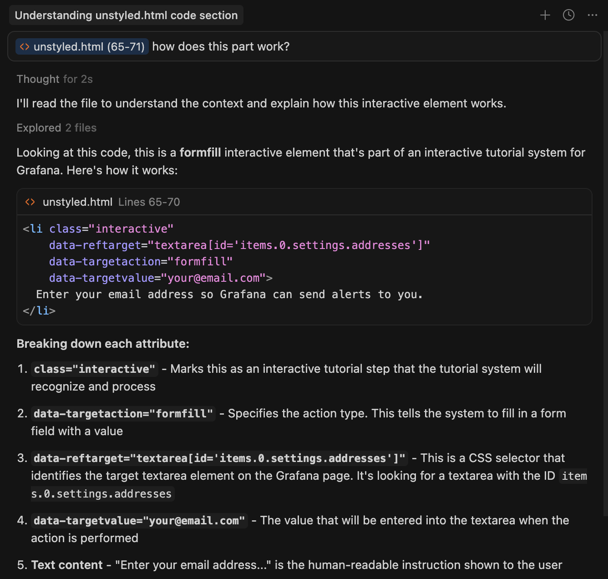

# Interactive Learning Tutorials

This repository contains interactive learning tutorials for Grafana, designed by
Developer Advocacy. It includes JSON guide content and is designed to work with
the Block Editor and Cursor's AI assistant.

## First: Understand What We're Building!

0. Go to [Drilldown section of Grafana Play](https://play.grafana.org/drilldown)
1. Click the `?` help icon in the upper right hand corner of the screen, to open the interactive learning plugin

2. Make sure you're on the Drilldown page, check the Recommendations tab.
3. Follow the _Interactive Guide: Explore Drilldowns 101_ by clicking the "View" button by that recommendation. We're going to build
an interactive guide like that!
4. Notice the structure: it's built in sections, of individual steps, with each step having a "Show Me" and "Do It" option.

## Quick Start: Let's Build a new Interactive Guide

### For Grafana Employees

The fastest way to get started:

1. Go to [pathfinder.grafana-dev.net](https://pathfinder.grafana-dev.net)
2. Log in with your Grafana credentials
3. Navigate to the plugin configuration with `?dev=true`:
   `https://pathfinder.grafana-dev.net/plugins/grafana-pathfinder-app?dev=true`
4. Enable "Dev Mode" checkbox and save
5. Click the `?` help icon to open the Pathfinder sidebar
6. Use the **Block Editor** (in the dev tools section) to create your guide

*The Block Editor provides a visual interface for composing guides from blocks.*

### Alternative: Run the Plugin Locally

If you don't have access to pathfinder.grafana-dev.net (e.g., you're an open source community contributor, customer, or internal user who doesn't have the right permissions set up), you can run the Pathfinder plugin locally:

* **Make sure you have Cursor** (it's worth it). [Download it](https://cursor.com/downloads).
* Clone this repo to your machine. Also clone the [interactive learning plugin](https://github.com/grafana/grafana-pathfinder-app)
* Start the plugin repo. [Full instructions are here](https://github.com/grafana/grafana-pathfinder-app/blob/main/docs/developer/LOCAL_DEV.md) but the short version is: `npm install` then `npm run build && npm run server` and go to http://localhost:3000/
* Once you've logged into your running version of Grafana, go to the Interactive Learning Plugin settings page, and set the
end of the URL to include `?dev=true`. The full URL should be roughly `{instance}/plugins/grafana-pathfinder-app?dev=true`
* **Click the `?` help icon** (as shown earlier in step 1) to open the sidebar where you'll find the dev mode settings:

* **The checkbox will not appear unless `dev=true` is in the URL**. Select that and save plugin settings

### Writing Your Guide with the Block Editor

Interactive guides are JSON documents. See [explore-drilldowns-101/content.json](explore-drilldowns-101/content.json) for a complete example.

The **Block Editor** is the recommended way to create guides:

1. Open the Block Editor from the Pathfinder sidebar (dev mode must be enabled)
2. Click "Add Block" to add content blocks (markdown, interactive, section, etc.)
3. Use the **Record** feature on sections to capture your interactions automatically
4. Preview your guide with the Preview toggle
5. Export via "Copy JSON" or create a GitHub PR directly from the editor

**Alternative: Cursor-assisted authoring**

This repository includes Cursor AI prompts and commands for guide authoring.
In Cursor, you can use `/new My Guide Name` to scaffold a new guide directory.
See the `.cursor/` folder for available commands and prompts.

### Iterate & Develop

The Block Editor auto-saves your work to localStorage, so you can iterate without losing progress.

To test your guide:

1. Use the **Preview** mode in the Block Editor to see how it renders
2. Alternatively, export the JSON and use the **Tutorial Tester** to load it by URL

The Tutorial Tester accepts:
- A local file URL (if using [Live Server extension](https://marketplace.cursorapi.com/items/?itemName=ritwickdey.LiveServer))
- A GitHub raw URL (push to a branch first)
- Pasted JSON content

**NOTE**: Tutorial Tester and Block Editor only appear when dev mode is enabled.

### DOM Selectors

Writing interactive guides usually boils down to writing lists of steps and their accompanying text, which is
straightforward. The `reftarget` field in your JSON blocks contains DOM selectors.
**These are critical to get right**, because they tell the plugin which buttons, input boxes, etc. are being
targeted by the interactive features.

### Interactive Action Types: Asking Cursor for Help

What kinds of interactive steps can you make? See [docs/interactive-types.md](docs/interactive-types.md) for a full list, or
just ask Cursor. A good way to get started is to read one of the existing guides, highlight bits and
add it to the model context, and ask Cursor "How does this part work?"

Cursor knows quite a lot about what's in this repo! Use `Ask` mode and ask it
questions about how different interactive elements work. Cursor will use the `docs`
folder in this repo to answer your questions.

Here's an example of Cursor in Ask mode, explaining a feature:

## Ask Us Questions!

* Talk to Tom Glenn, David Allen, or Simon Prickett, all of whom have done this before. They will help.
* They can be reached by email (if they have shared with you) or internal on Grafana's slack in `#proj-grafana-pathfinder`

## Getting Your Tutorial Into The Plugin

Once you're finished with a draft, we need to add it to the recommender. This will
ensure that the right users get the content recommended to them when using Grafana.

1. Open a PR to this repo with your new guide! Ping Jay Clifford, Tom Glenn, or
David Allen to get it merged.
2. We'll wire it into the recommender for you.
3. MAKE SURE TO INCLUDE IN YOUR PR: When should users see your guide? What are they looking at in the UI when it appears as a recommendation? Who should see your guide? Admins only? Commercial stacks? Free stacks? "Everybody" is an acceptable answer. This determines how it will appear.

## Full Reference Documentation

For complete reference documentation:

- **This repo**: See [.cursor/ai-guide-reference.mdc](.cursor/ai-guide-reference.mdc) for AI-assisted authoring
- **Pathfinder Plugin Docs**: See [grafana-pathfinder-app/docs](https://github.com/grafana/grafana-pathfinder-app/tree/main/docs) on GitHub

Primary documentation files in this repo:

| Topic | File |
|-------|------|
| Guide Format | [docs/json-guide-format.md](docs/json-guide-format.md) |
| Block Types | [docs/interactive-types.md](docs/interactive-types.md) |
| Properties | [docs/json-block-properties.md](docs/json-block-properties.md) |
| Requirements | [docs/requirements-reference.md](docs/requirements-reference.md) |
| Selectors | [docs/selectors-and-testids.md](docs/selectors-and-testids.md) |
